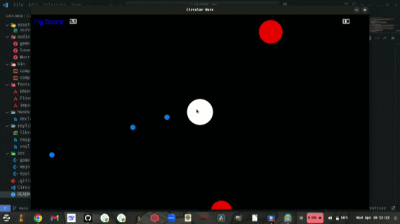

# 
Circular Attack !

#### **Circular attack** is a simple 2D shooter survival game inspired by it's web version originally created by youtuber *Chris Courses*  

  

## 
Features

* 💙 cool modern health icon 
* 🗛 Modern fonts to express scores, game over and health status 
* ☴  Simple shapes as game components for simplicity and comfort
* 🆠  Score Stystem
* 🎼 Pleasant Background music, shooting effect and game over effect

##  
Trivia

#### 
 You're stuck in space!
 surrounded by circular enemies hope is not really lost because you can defend yourself with the **magic balls that you shoot.** Your goal is simple!, destroy as much enemies as you can while you can! they won't stop!!, 
 so make your efforts worthwhile 🗣 

##   
How to play

#### Gameplay is simple. Use the mouse/trackpad to target the position you want to shoot and right/left click to shoot. Be careful not to hit the 
esc button
 as it terminates the game instantly.

##   
Requirements

* A desktop enviroment using windows or linux os
* A C/C++ compiler
* A working mouse/trackpad
* The terminal or Command Prompt(cmd)

##   
Installation Guide

